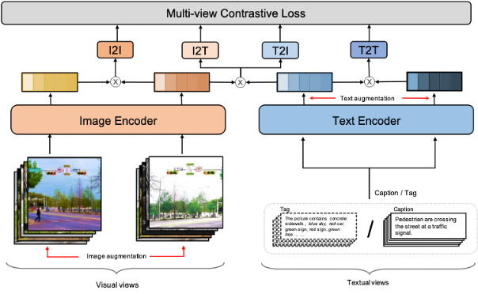

简体中文|[English](./readme_en.md) 
# ERNIE-ViL 2.0
Cross-modal pretraining is one of the important research directions in the field of artificial intelligence. How to make machines have the ability to understand and think like humans requires the integration of multimodal information such as language, speech, and vision.  
In recent years, significant progress has been made in single-modal semantic understanding technologies such as vision, language, and speech. But more AI real-world scenarios actually involve information from multiple modalities at the same time. For example, an ideal AI assistant needs to communicate with humans based on multimodal information such as language, voice, and actions, which requires machines to have multimodal semantic understanding capabilities.  
Cross-modal pre-training models based on cross-encoders (such as ViLBERT, ERNIE-ViL, etc.) have achieved great results in many cross-modal tasks, especially in complex cross-modalities such as visual common sense reasoning. The improvement in state tasks is even greater. However, the cross-modal attention mechanism between modalities brings a lot of computational cost, and the application in online systems such as large-scale cross-modal retrieval faces huge challenges. Recently, the dual-tower pre-training framework (dual encoder) based on contrastive learning can make full use of large-scale image-text alignment data, and has shown a great improvement in tasks such as cross-modal retrieval. Widespread concern.  
The traditional vision-language pre-training technology is based on single-view contrastive learning, which cannot learn the correlation between multiple modalities and within modalities. ERNIE-ViL 2.0 proposes a pre-training framework based on multi-view contrastive learning. By constructing With rich visual/textual perspectives, it is able to simultaneously learn multiple correlations between modalities and within modalities, thereby learning more robust cross-modal alignment, and achieving state-of-the-art on tasks such as cross-modal retrieval.

## Method



## Performance
Chinese model:
AIC-ICC dataset
| Model | Structure | T2I R@1 | I2T R@1 | meanRecall |
|------------|---------|-------|--------|----|
| ERNIE-ViL 2.0 Base (ViT)| ViT-B-16 + ERNIE 3.0 Base| 17.93 | 30.41 | 38.57 |
| ERNIE-ViL 2.0 Base (CNN) | EfficientNET-B5 + ERNIE 2.0 Base | 14.77 | 26.05 | 34.47 |
| ERNIE-ViL 2.0 Large (ViT) | ViT-L-14 + ERNIE 3.0 Large | **20.17** | 32.29 | **41.08** |
| ERNIE-ViL 2.0 Large (CNN) | EfficientNET-L2 + ERNIE 2.0 Large | 19.01 | **33.65** | 40.58 |

COCO-CN dataset
| Model | Structure | T2I R@1 | I2T R@1 | meanRecall |
|------------|---------|-------|--------|----|
| ERNIE-ViL 2.0 Base (ViT) | ViT-B-16 + ERNIE 3.0 Base | 66.00 | 65.90 | 84.28 |
| ERNIE-ViL 2.0 Base (CNN) | EfficientNET-B5 + ERNIE 2.0 Base | 62.70 | 65.30 | 83.17 |
| ERNIE-ViL 2.0 Large (ViT) | ViT-L-14 + ERNIE 3.0 Large| **70.30** | 68.80| **86.32** |
| ERNIE-ViL 2.0 Large (CNN) | EfficientNET-L2 + ERNIE 2.0 Large | 69.80 | **69.50** | 86.28 |

## Example
Here is an example of the image and text retrieval task of ZERO-SHOT on COCO-CN using ERNIE-ViL 2.0 Base (ViT):
* Model download:
[ERNIE-ViL 2.0 Base (ViT)]()
* Data preparation: We built a [COCO-CN test set](./packages/coco/test.coco_cn.data), the data format (the default is UTF-8 encoding), is three columns, separated by \t , the first column is the text, the second column is the image ID in coco, and the third column is the image encoded by base64.
* First install the environment, install [paddle>=2.1.0](https://www.paddlepaddle.org.cn/install/quick?docurl=/documentation/docs/zh/develop/install/pip/linux-pip.html), and the packages required by [requirements.txt](requirements.txt)
* Then, configure ./packages/configs/ernie_vil_base.yaml, please refer to the notes in the configuration for details.
* Finally, run the following command to get cross-modal graphics and text embeddings
```bash
$ bash run_infer.sh 2 ./packages/configs/ernie_vil_base.yaml
````
Use the following script to evaluate by defining the output location in ./packages/configs/ernie_vil_base.yaml:

```
$ python eval_retri.py test_out/cross_modal_embeddings.out
```

The following are the results of the ERNIE-ViL 2.0 Base model in COCO-CN

| Name | R@1 | R@5 | R@10 | meanRecall |
|------------|-------|-------|--------|------------|
| Text2Image | 66.00 | 90.00 | 96.10 | 84.03 |
| Image2Text | 65.90 | 91.40 | 96.30 | 84.53 |
| MeanRecall | 65.95 | 90.70 | 96.20 | 84.28 |

## Other
The image data storage format adopted by ERNIE-ViL is [base64](https://www.base64decode.org/) format.